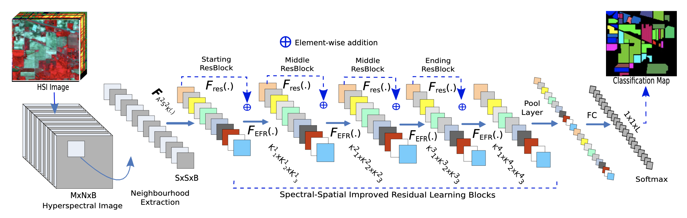

[](https://paperswithcode.com/sota/hyperspectral-image-classification-on-kennedy?p=attention-based-adaptive-spectral-spatial)
	
[](https://paperswithcode.com/sota/hyperspectral-image-classification-on-pavia?p=attention-based-adaptive-spectral-spatial)
	
[](https://paperswithcode.com/sota/hyperspectral-image-classification-on-indian?p=attention-based-adaptive-spectral-spatial)


# Attention-Based Adaptive Spectral-Spatial Kernel ResNet for Hyperspectral Image Classification

This repository is the official implementation of [Attention-Based Adaptive Spectral-Spatial Kernel ResNet for Hyperspectral Image Classification](https://ieeexplore.ieee.org/document/9306920). 
[](https://colab.research.google.com/drive/1x2CYfaUXNjX4yDMLCvoVFqAMZXZwwVgS)


>📋  Abstract:
Hyperspectral images (HSIs) provide rich spectral-spatial information with stacked hundreds of contiguous narrowbands. Due to the existence of noise and band correlation, the selection of informative spectral-spatial kernel features poses a challenge. This is often addressed by using convolutional neural networks (CNNs) with receptive field (RF) having fixed sizes. However, these solutions cannot enable neurons to effectively adjust RF sizes and cross-channel dependencies when forward and backward propagations are used to optimize the network. In this article, we present an attention-based adaptive spectral-spatial kernel improved residual network (A²S²K-ResNet) with spectral attention to capture discriminative spectral-spatial features for HSI classification in an end-to-end training fashion. In particular, the proposed network learns selective 3-D convolutional kernels to jointly extract spectral-spatial features using improved 3-D ResBlocks and adopts an efficient feature recalibration (EFR) mechanism to boost the classification performance. Extensive experiments are performed on three well-known hyperspectral data sets, i.e., IP, KSC, and UP, and the proposed A²S²K-ResNet can provide better classification results in terms of overall accuracy (OA), average accuracy (AA), and Kappa compared with the existing methods investigated.




## Requirements

To install requirements:

```setup
conda env create -f environment.yml
```

To download the dataset and setup the folders, run:

```
bash setup_script.sh
```

## Training

To train the model(s) in the paper, run this command in the A2S2KResNet folder:

```train
python A2S2KResNet.py -d <IN|UP|KSC> -e 200 -i 3 -p 3 -vs 0.9 -o adam
```

## Results

Our model achieves the following performance on 10% of datasets:

### [India Pines](http://www.ehu.eus/ccwintco/uploads/6/67/Indian_pines_corrected.mat) dataset

| Model name         | OA  |
| ------------------ |---------------- |
| A2S2K-ResNet   | 98.66 ± 0.004 % |

### [Kennedy Space Center](http://www.ehu.es/ccwintco/uploads/2/26/KSC.mat) dataset

| Model name         | OA  |
| ------------------ |---------------- |
| A2S2K-ResNet   | 99.34 ± 0.001 % |

### [University of Pavia](http://www.ehu.eus/ccwintco/uploads/e/ee/PaviaU.mat) dataset

| Model name         | OA  |
| ------------------ |---------------- |
| A2S2K-ResNet   | 99.85 ± 0.001 % |

For deatiled results refer to Table IV-VII of our paper. 


## Citation

If you use A2S2K-ResNet code in your research, we would appreciate a citation to the original paper:
```
    @article{roy2020attention,
     title={Attention-based adaptive spectral-spatial kernel resnet for hyperspectral image classification},
     author={Swalpa Kumar Roy, and Suvojit Manna, and Tiecheng Song, and Lorenzo Bruzzone},
     journal={IEEE Transactions on Geoscience and Remote Sensing},
     year={2020},
     publisher={IEEE}
     }
```
